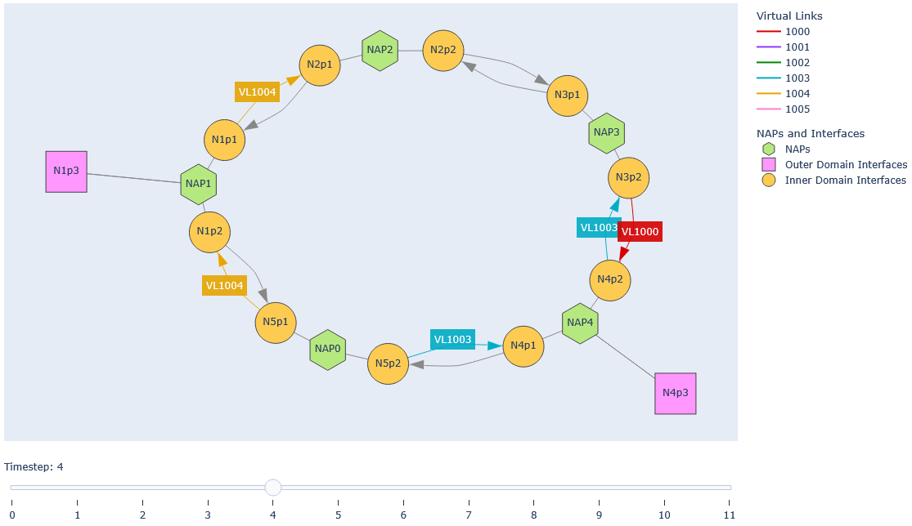
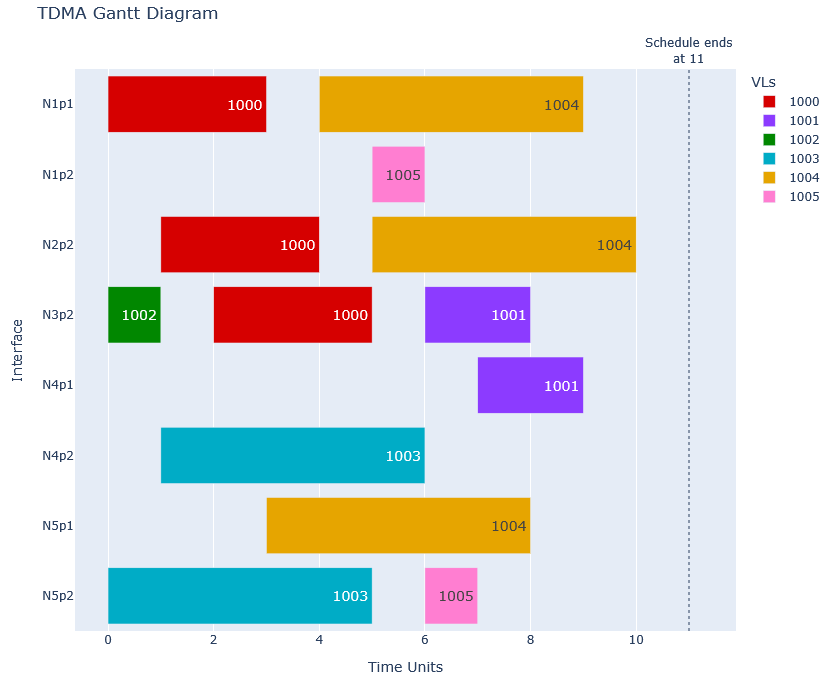

# ASDB Scheduler

Project for tooling allowing for the generation and visualization of a TDMA schedule for an example
ASDB network.

The program is split into two functions:

- `scheduler.py`: Generates a TDMA schedule from input
- `visualizer.py`: Offers functions for visual representation of the schedule or network graph
- `verifier.py`: Verifies the TDMA schedule against the scheduler input

The executable program parts can be found in the (src)[src] folder. Files for the documentation and output examples reside in the (doc)[doc] folder.

Dependencies and build options are found in the (pyproject.toml)[pyproject.toml].

## Usage Scheduler

```sh
pip install -e .[test,dev]
```

For the scheduler.py

```
usage: scheduler [-h] [-o OUTPUT_FOLDER] [-i INPUT_SCHEMA]
                 [-s SCHEDULE_SCHEMA] [-c CONFIG_SCHEMA]
                 [-l {debug,info,warning,warn,error,fatal,critical}]
                 [input-scheduler]

Scheduler for TDMA

positional arguments:
  input-scheduler       scheduler input file name (default:
                        example_network.json)

options:
  -h, --help            show this help message and exit
  -o OUTPUT_FOLDER, --output-folder OUTPUT_FOLDER
                        output folder name (default: output)
  -i INPUT_SCHEMA, --input-schema INPUT_SCHEMA
                        input file schema (default:
                        schema_input_scheduler.json)
  -s SCHEDULE_SCHEMA, --schedule-schema SCHEDULE_SCHEMA
                        output schedule file schema (default:
                        schema_output_scheduler.json)
  -c CONFIG_SCHEMA, --config-schema CONFIG_SCHEMA
                        output config file schema (default:
                        schema_output_config.json)
  -l {debug,info,warning,warn,error,fatal,critical}, --log-level {debug,info,warning,warn,error,fatal,critical}
                        log level (default: info)
```

Example Scheduler:

```sh
python scheduler.py example_network.json -o Results
```

Example output from the `visualizer.py`:




Interactive HTML-output can be found in the `doc` folder.

## Usage Verifier

For the verifier.py

```
usage: verifier [-h] [-os OUTPUT_SCHEMA] [-is INPUT_SCHEMA] [-c] [-l {debug,info,warning,warn,error,fatal,critical}] [output-scheduler] [input-scheduler]

Verifier for TDMA schedule and config

positional arguments:
  output-scheduler      scheduler output file (default: verifier_output_schedule_example.json)
  input-scheduler       scheduler input file (default: verifier_input_example.json)

options:
  -h, --help            show this help message and exit
  -os OUTPUT_SCHEMA, --output-schema OUTPUT_SCHEMA
                        output file schema (default: schema_output_scheduler.json)
  -is INPUT_SCHEMA, --input-schema INPUT_SCHEMA
                        onput file schema (default: schema_input_scheduler.json)
  -c, --config          input file and input schema is interpreted as config; compatibility to old input file format (default: False)
  -l {debug,info,warning,warn,error,fatal,critical}, --log-level {debug,info,warning,warn,error,fatal,critical}
                        log level (default: info)
```

Example Verifier:

```sh
python verifier.py verifier_output_schedule_example.json verifier_input_example.json
```

## Verifier Return Codes

| Return Code | Meaning                                                                       |
| ----------- | ----------------------------------------------------------------------------- |
| -1          | WARNING: max width of assigned best-effort VLs is greater then the slot width |
| 0           | Input schedule is verified                                                    |
| 1           | Scheduler output SchemaError                                                  |
| 2           | Scheduler output ValidationError                                              |
| 3           | Scheduler input SchemaError                                                   |
| 4           | Scheduler input ValidationError                                               |
| 5           | Slot ended after cycle time                                                   |
| 6           | Slot overlaps with next slot                                                  |
| 7           | Last slot exceeds cycle time with min GBT                                     |
| 8           | Width of slot not wide enough                                                 |
| 9           | Target node not reachable                                                     |
| 10          | Latency of path exceeds max allowed latency                                   |
| 11          | Latency between successive slots is wrong                                     |
| 12          | Redundant VLs use the same path                                               |
| 13          | VL with outer domain source branches at first NAP                             |

### Additional Return Codes for Configuration Verification

Inner domain to outer domain mappings:

| Return Code | Meaning                                  |
| ----------- | ---------------------------------------- |
| 50          | Multiple mappings for the same VL        |
| 51          | Channel number different                 |
| 52          | Interface type different                 |
| 53          | Multiple ingress slots                   |
| 54          | Inner domain link ID wrong               |
| 55          | 'True' for parameter 'last' wrong        |
| 56          | 'False' for parameter 'last' wrong       |
| 57          | No mapping found for VL                  |
| 58          | Deduplication method or source different |

Outer domain to inner domain mappings:

| Return Code | Meaning                           |
| ----------- | --------------------------------- |
| 80          | Multiple mappings for the same VL |
| 81          | Channel number different          |
| 82          | Interface type different          |
| 83          | Multiple egress slots             |
| 84          | Inner domain link ID wrong        |
| 85          | No mapping found for VL           |

## License

Licensed under either of

- Apache License, Version 2.0 ([LICENSE-APACHE](LICENSE-APACHE) or http://www.apache.org/licenses/LICENSE-2.0)
- MIT License ([LICENSE-MIT](LICENSE-MIT) or http://opensource.org/licenses/MIT)

at your option.

## Contribution

Unless you explicitly state otherwise, any contribution intentionally submitted for inclusion in the work by you, as defined in the Apache-2.0 license, shall be dual licensed as above, without any additional terms or conditions.

## Copyright

Copyright © 2026 Deutsches Zentrum für Luft- und Raumfahrt e.V. (DLR)
